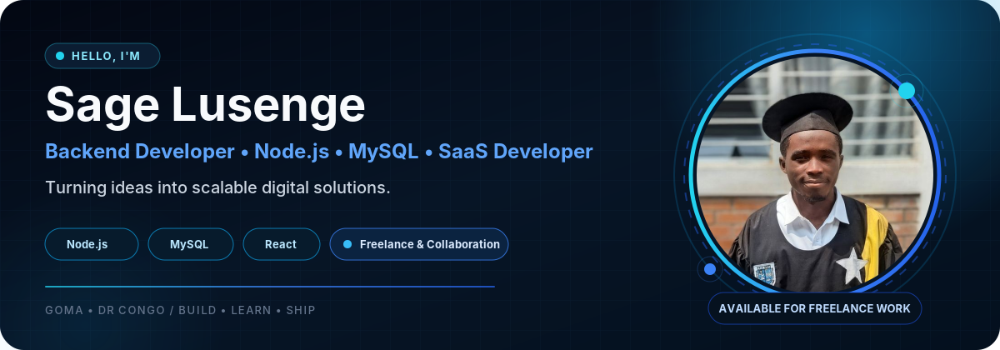
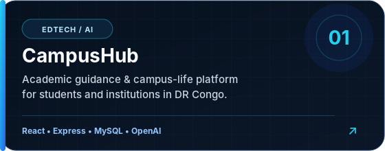
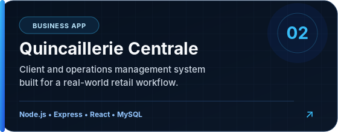
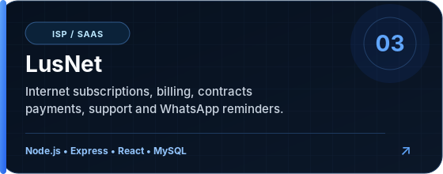
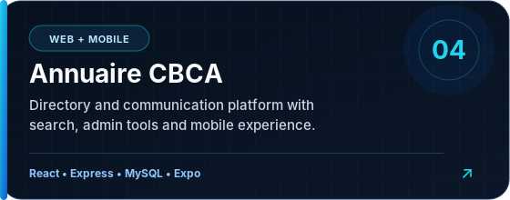

  

  
  
  
  
  

  

---

## 👨🏾‍💻 About Me

I’m **Sage Lusenge**, a backend-focused developer who enjoys turning real-world needs into reliable digital products.

- ⚙️ Building **REST APIs and business logic** with Node.js & Express
- 🗄️ Designing and working with **MySQL databases**
- 🖥️ Creating full-stack products with **React**
- 🚀 Interested in **SaaS, business applications and scalable systems**
- 🤝 Open to **freelance opportunities and collaborations**

---

## ⚡ Tech Stack

  

  
  
  
  

---

## 🚀 Featured Projects

  
  

  
  

### CampusHub
An academic guidance and campus-life platform for students and educational institutions in the Democratic Republic of the Congo, combining a verified academic catalog, role-based spaces and AI-assisted guidance.

### Quincaillerie Centrale App
A client and business operations management application built with a Node.js/Express backend and a React frontend for a practical retail workflow.

### LusNet
An ISP management platform for clients, contracts, subscriptions, billing, payments, equipment, technical support and WhatsApp reminders.

### Annuaire CBCA
A web and mobile directory platform with real-time search, administration tools, WhatsApp integration and an Expo mobile experience.

---

## 📊 GitHub Activity

  
  

  

---

## 🤝 Let’s Build Something Useful

I’m available for **freelance projects, technical collaborations and professional opportunities** involving backend development, SaaS products, APIs, MySQL databases and full-stack business applications.

  <a href="https://portfolio-sagelusenge.onrender.com/"><b>Portfolio</b></a>
  &nbsp;•&nbsp;
  <a href="https://www.linkedin.com/in/sage-lusenge-a54a6835b"><b>LinkedIn</b></a>
  &nbsp;•&nbsp;
  <a href="mailto:sagelusenge@gmail.com"><b>Email</b></a>
  &nbsp;•&nbsp;
  <a href="https://wa.me/243980208012"><b>WhatsApp</b></a>

  Turning ideas into scalable digital solutions.

